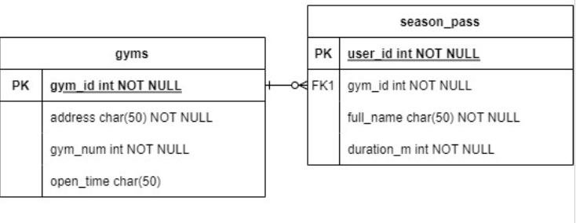
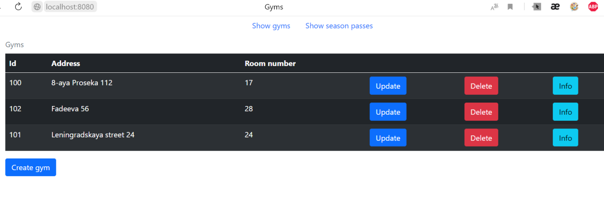
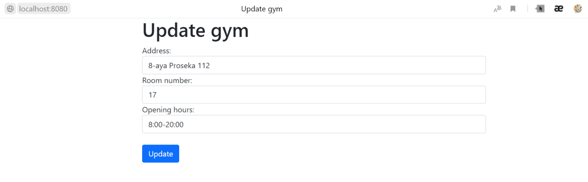
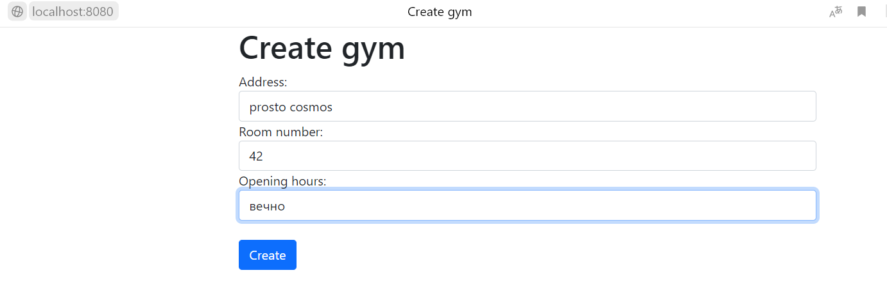
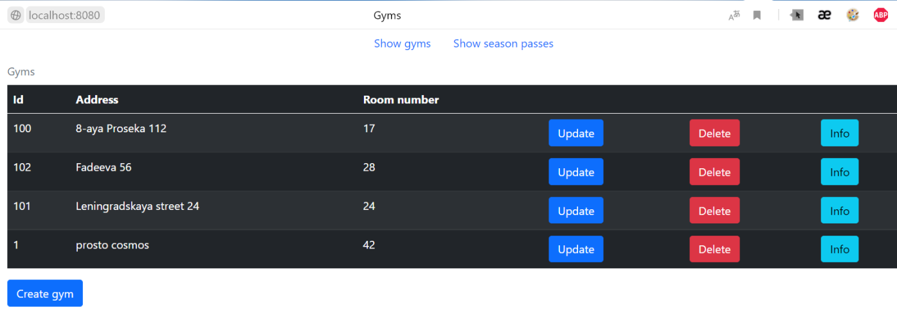
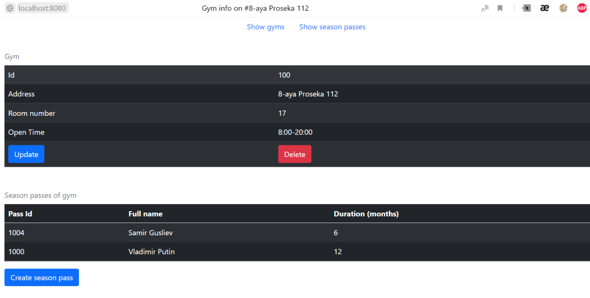
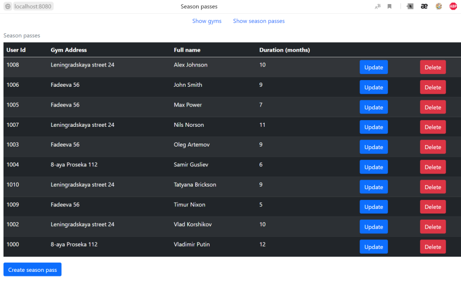

# esap_demo2
В данной лабораторной работе работе использовалось две таблицы: таблица спортзалов сети спортзалов, и таблица абонементов в спортзалы данной сети. Каждый владелец абонемента имеет пропуск в один зал, отмеченный в gym_id.

Скриншоты работы программы:

Обновление информации о тренажёрном зале:

Создание записи об учётном зале:

Обновлённая таблица

Связанные с тренажёрным залом пользователи:

Таблица пользователей, создаём новую запись:

Удаляем созданную запись:

